## 🌟 Portal Administrativo para Academia

### 📘 Descripción del Proyecto
Este portal administrativo está diseñado para gestionar eficientemente las operaciones de una academia educativa, incluyendo:

- 📚 **Registro de cursos** para diferentes niveles:
  - Primaria
  - Secundaria
  - Preuniversitario
  - Universitario
- 💲 **Gestión de costos** para 1, 2 o 3 estudiantes.
- 👩‍🏫 **Registro de profesores**, incluyendo:
  - Cursos que dictan.
  - Horarios disponibles semanales.
- 👨‍🎓 **Registro de estudiantes y grupos de estudio.**
- 🗓️ **Gestión del horario semanal** de la academia.
- 📝 **Registro de asistencia y pagos** de estudiantes.

### 💻 Tecnologías Utilizadas

- **Front-End:**
  - HTML
  - CSS
  - Bootstrap
  - jQuery
- **Back-End:**
  - PHP
- **Servidor Local:**
  - WAMP

### 🚀 Características Principales

1. 📋 **Gestión de Cursos:** Permite registrar cursos en diferentes niveles educativos con costos personalizados para grupos de 1, 2 o 3 estudiantes.
2. 👩‍🏫 **Administración de Profesores:** Los profesores pueden registrarse con los cursos que dictan y sus horarios disponibles.
3. 👨‍🎓 **Control de Estudiantes y Grupos:** Registro completo de estudiantes, grupos de estudio y sus horarios.
4. 📊 **Control Administrativo:** Gestión de asistencias y pagos de estudiantes.

### ⚙️ Instalación

1. Clona el repositorio:
   ```bash
   git clone https://github.com/fenyx144/portal-academia.git
   ```
2. Configura el entorno:

Instala WAMP.

3. Copia los archivos del proyecto en la carpeta www de WAMP.

4. Configura la base de datos:

Carga el archivo SQL del repositorio en phpMyAdmin para configurar la base de datos.

5. Inicia el servidor:

Inicia WAMP y accede al portal en http://localhost/portal-academia.

### 🔧 Uso

Accede al portal para:

Registrar cursos, profesores y estudiantes.

Administrar horarios y asistencias.

Gestionar pagos y reportes.
### 📷 Capturas de Pantalla

🔑 Inicio de Sesión
Usuario: admin, password: 12345
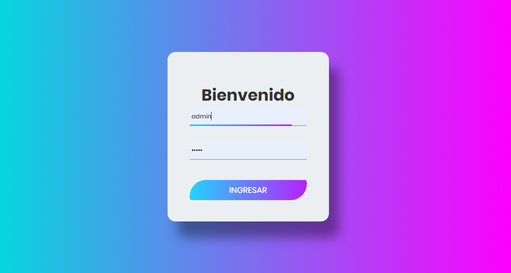

🖥️ Panel Principal

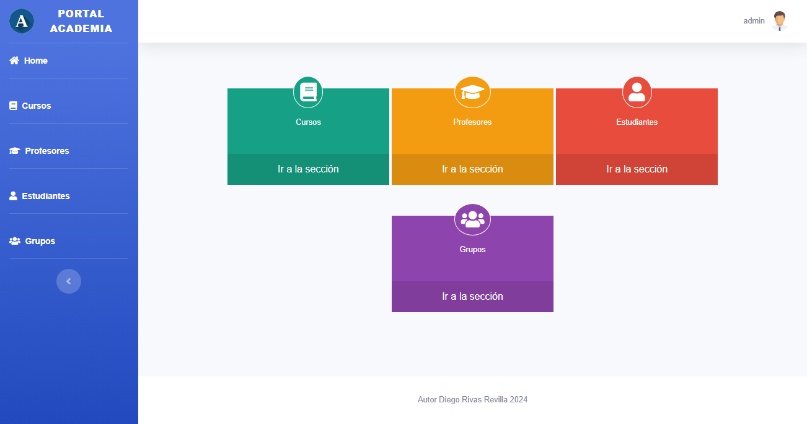

📚 Registro de Cursos
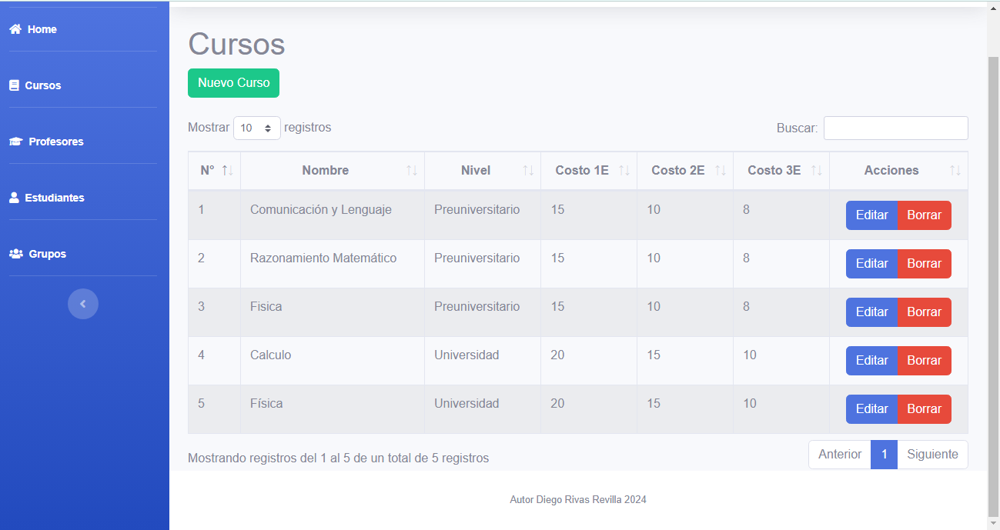
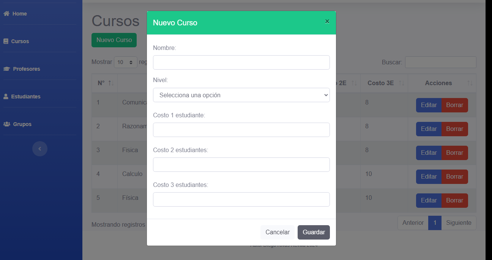
👨‍🏫 Profesores
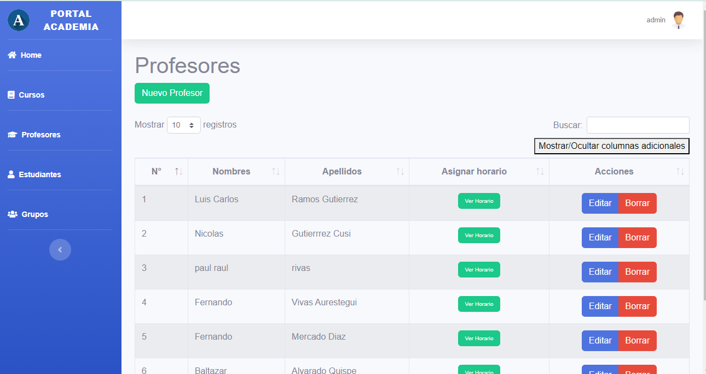
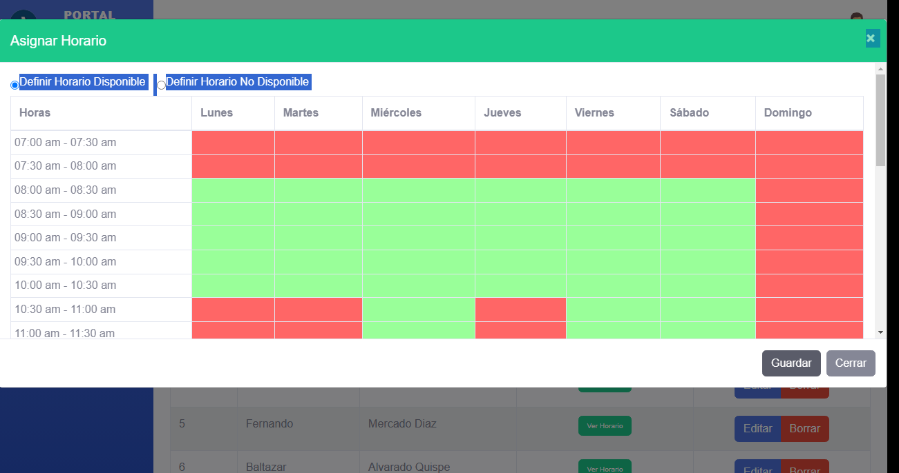


🧑Estudiantes

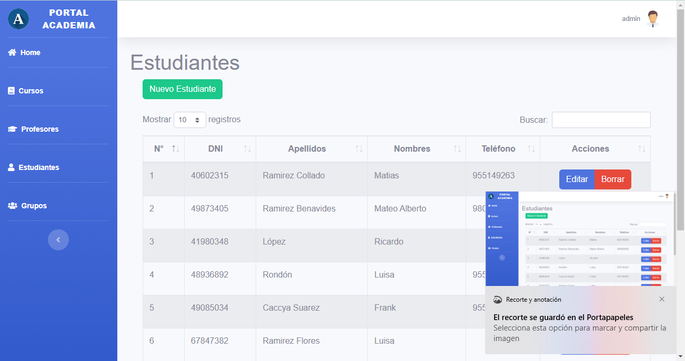
👥Grupos

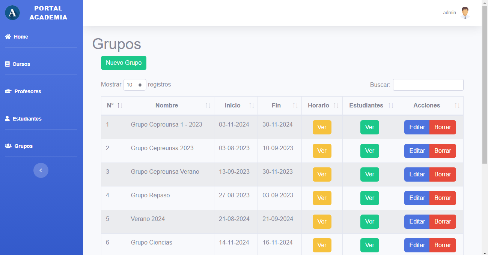

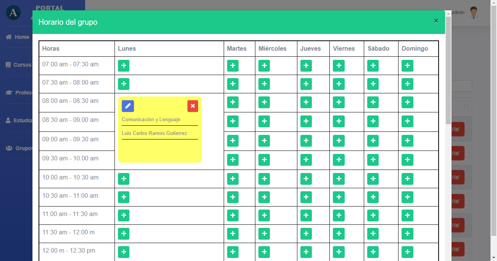

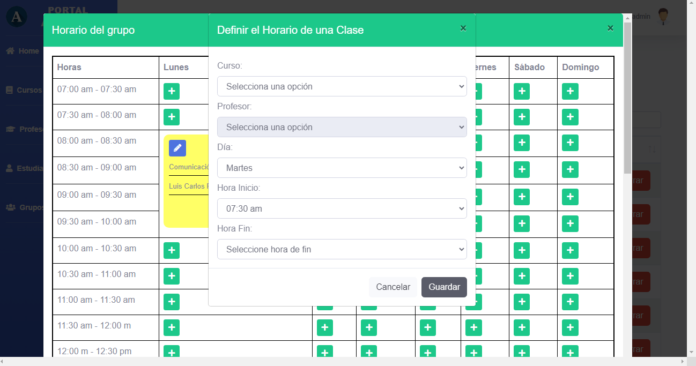
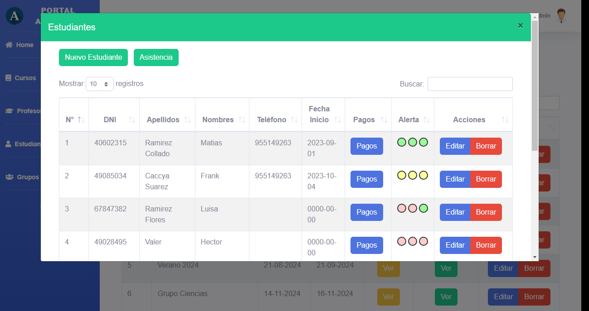

✒️ Autor

Diego Rivas Revilla